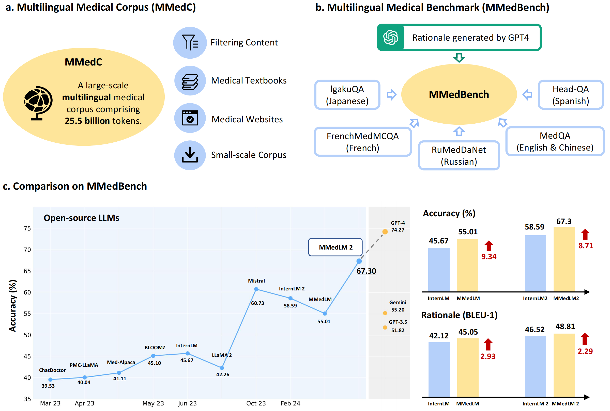
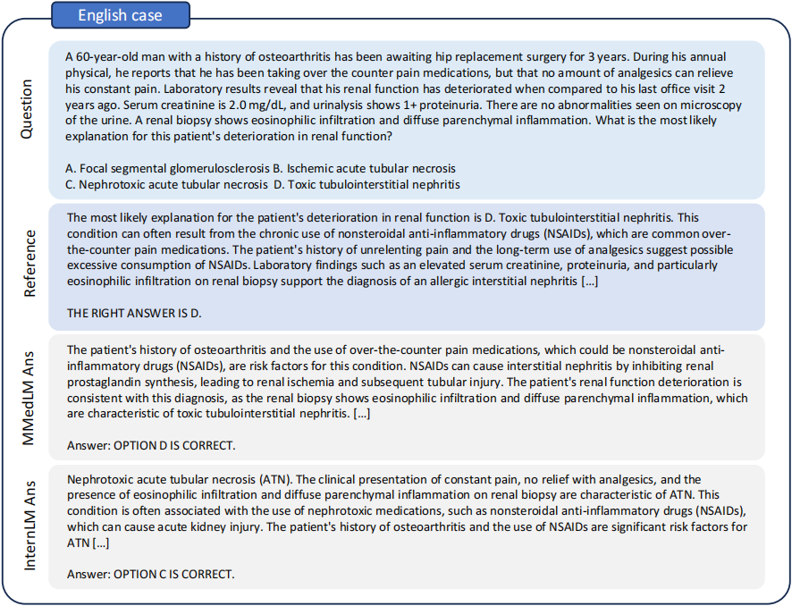

# MMedLM


<div align="center">
  
  <div align="center"></div>
</div>


[Nature Communications] The official codes for "Towards Building Multilingual Language Model for Medicine".

[Paper (Arxiv version)](https://arxiv.org/abs/2402.13963)

[Paper (Nature Communications)](https://www.nature.com/articles/s41467-024-52417-z)

[Leaderboard](https://henrychur.github.io/MultilingualMedQA/)

Models: [MMedLM-7B](https://huggingface.co/Henrychur/MMedLM), [MMedLM 2-7B](https://huggingface.co/Henrychur/MMedLM2), [MMedLM 2-1.8B](https://huggingface.co/Henrychur/MMedLM2-1.8B), [MMed-Llama 3-8B](https://huggingface.co/Henrychur/MMed-Llama-3-8B), [MMed-Llama3-8B-EnIns](https://huggingface.co/Henrychur/MMed-Llama-3-8B-EnIns)

Datasets: [MMedC](https://huggingface.co/datasets/Henrychur/MMedC),[MMedBench](https://huggingface.co/datasets/Henrychur/MMedBench)
## Introduction
In this paper, we aim to develop an open-source, multilingual language model for medicine. In general, we present the contribution from the following aspects: 
1. **Corpus dataset.** For multilingual medical-specific adaptation, we construct a new multilingual medical corpus, that contains approximately 25.5B tokens encompassing 6 main languages, termed as MMedC, that enables auto-regressive training for existing general LLMs. 
2. **Benchmark.** To monitor the development of multilingual LLMs in medicine, we propose a new multilingual medical multi-choice question-answering benchmark with rationale, termed as MMedBench.
3. **Model Evaluation.** We have assessed a number of popular LLMs on our benchmark, along with those further auto-regressive trained on MMedC, as a result, our final model, termed as MMedLM 2, with only 7B parameters, achieves superior performance compared to all other open-source models, even rivaling GPT-4 on MMedBench. 



## News
[2024.9.27] Our paper has been accepted by Nature Communications!

[2024.5.24]  We release [MMed-Llama 3-8B](https://huggingface.co/Henrychur/MMed-Llama-3-8B) and [MMed-Llama3-8B-EnIns](https://huggingface.co/Henrychur/MMed-Llama-3-8B-EnIns). MMed-Llama 3 is based on Llama 3 and futher pretrained on MMedC, and MMed-Llama 3 EnIns is a fine-tuned version with additional English instructions (from PMC-LLaMA).

[2024.3.1]  We release [MMedLM 2-1.8B](https://huggingface.co/Henrychur/MMedLM2-1.8B), a 1.8B light-weight model based on InternLM 2-1.8B. With an auto-regressive continues training on MMedC, MMedLM 2-1.8B can exceed the performance of most 7B models, including InternLM and LLaMA 2. 

[2024.2.21] Our leaderboard web can be found [here](https://henrychur.github.io/MultilingualMedQA/). We look forward to more superior efforts in multilingual medical LLMs!.

[2024.2.21] Our pre-print paper is released ArXiv. Dive into our findings [here](https://arxiv.org/abs/2402.13963).

[2024.2.20] We release [MMedLM](https://huggingface.co/Henrychur/MMedLM) and [MMedLM 2](https://huggingface.co/Henrychur/MMedLM2). With an auto-regressive continues training on MMedC, these models achieves superior performance compared to all other open-source models, even rivaling GPT-4 on MMedBench.

[2023.2.20] We release [MMedC](https://huggingface.co/datasets/Henrychur/MMedC), a multilingual medical corpus containing 25.5B tokens.

[2023.2.20] We release [MMedBench](https://huggingface.co/datasets/Henrychur/MMedBench), a new multilingual medical multi-choice question-answering
benchmark with rationale. 


## Usage
### Environment
In our experiments, we used A100 80 GB GPUs and the Slurm scheduling system. We provide a Slurm script to launch training. You can also remove the Slurm commands to run the code on a single machine.

For dependencies, we used Pytorch 1.13 and Transformers 4.37. For LoRA fine-tune, it is also necessary to install the corresponding PEFT library.

### Auto-regressive Training on MMedC
We provide all the code used for further training on MMedC. The codes are in the `pretrain` folder. You can check the [documentation](./pretrain/README.md) in the folder for how to use the codes.

* Note that this step requires at least 8 A100 80GB GPUs and training for over a month.

### Fine-tuning on MMedBench Trainset
We provide all the code used for fine-tuning. We support 2 fine-tuning methods: Full-Model Fine-tuning and PEFT Fine-Tuning.  Both codes are in the `finetune` folder. You can check the [documentation](./finetune/README.md) in the folder for how to use the codes.


### Inference on MMedBench Testset
We provide the code used for inference on MMedBench Testset. The codes are in the `pretrain` folder. You can check the [documentation](./inference/README.md) in the folder for how to use the codes.


### Data Collection Pipeline
We also release our Data Collection Pipeline, including codes of data filtering and Textbooks OCR. For OCR, you may need to install some extra dependencies. Please check out the **data_collection** folder for more details.

## Results on Commonly-used English Benchmarks
Here, we incorporate the additional English instructions (from PMC-LLaMA) into MMed-Llama\ 3 finetuning, 
and present a comparison between our model and other existing LLMs on various English benchmarks.

| Method              | Size | Year    | MedQA    | MedMCQA  | PubMedQA | MMLU_CK  | MMLU_MG  | MMLU_AN  | MMLU_PM  | MMLU_CB  | MMLU_CM  | Avg.      |
| ------------------- | ---- | ------- | -------- | -------- | -------- | -------- | -------- | -------- | -------- | -------- | -------- | --------- |
| MedAlpaca           | 7B   | 2023.3  | 41.7     | 37.5     | 72.8     | 57.4     | 69.0     | 57.0     | 67.3     | 65.3     | 54.3     | 58.03     |
| PMC-LLaMA           | 13B  | 2023.9  | 56.4     | 56.0     | 77.9     | -        | -        | -        | -        | -        | -        | -         |
| MEDITRON            | 7B   | 2023.11 | 57.2     | 59.2     | 74.4     | 64.6     | 59.9     | 49.3     | 55.4     | 53.8     | 44.8     | 57.62     |
| Mistral             | 7B   | 2023.12 | 50.8     | 48.2     | 75.4     | 68.7     | 71.0     | 55.6     | 68.4     | 68.1     | 59.5     | 62.97     |
| Gemma               | 7B   | 2024.2  | 47.2     | 49.0     | 76.2     | 69.8     | 70.0     | 59.3     | 66.2     | **79.9** | 60.1     | 64.19     |
| BioMistral          | 7B   | 2024.2  | 50.6     | 48.1     | 77.5     | 59.9     | 64.0     | 56.5     | 60.4     | 59.0     | 54.7     | 58.97     |
| Llama 3             | 8B   | 2024.4  | 60.9     | 50.7     | 73.0     | **72.1** | 76.0     | 63.0     | 77.2     | **79.9** | 64.2     | 68.56     |
| MMed-Llama 3~(Ours) | 8B   | -       | **65.4** | **63.5** | **80.1** | 71.3     | **85.0** | **69.6** | **77.6** | 74.3     | **66.5** | **72.59** |


## Results on MMedBench
Here we show the main results of models' performance on MMedBench. For more details, please check out our [paper](https://arxiv.org/abs/2402.13963).

### Accuracy(%)
| Method           | Size | Year    | MMedC     | MMedBench | English        | Chinese        | Japanese       | French         | Russian        | Spanish        | Avg.           |
|------------------|------|---------|-----------|-----------|----------------|----------------|----------------|----------------|----------------|----------------|----------------|
| GPT-3.5          | -    | 2022.12 | &#10007; | &#10007; | 56.88          | 52.29          | 34.63          | 32.48          | 66.36          | 66.06          | 51.47          |
| GPT-4            | -    | 2023.3  | &#10007; | &#10007; | 78.00 | 75.07 | 72.91 | 56.59 | 83.62 | 85.67 | 74.27 |
| Gemini-1.0 pro   | -    | 2024.1  | &#10007; | &#10007; | 53.73          | 60.19          | 44.22          | 29.90          | 73.44          | 69.69          | 55.20          |
| BLOOMZ           | 7B   | 2023.5  | &#10007; | trainset  | 43.28          | 58.06          | 32.66          | 26.37          | 62.89          | 47.34          | 45.10          |
| InternLM         | 7B   | 2023.7  | &#10007; | trainset  | 44.07          | 64.62          | 37.19          | 24.92          | 58.20          | 44.97          | 45.67          |
| Llama 2         | 7B   | 2023.7  | &#10007; | trainset  | 43.36          | 50.29          | 25.13          | 20.90          | 66.80          | 47.10          | 42.26          |
| MedAlpaca        | 7B   | 2023.3  | &#10007; | trainset  | 46.74          | 44.80          | 29.64          | 21.06          | 59.38          | 45.00          | 41.11          |
| ChatDoctor       | 7B   | 2023.4  | &#10007; | trainset  | 43.52          | 43.26          | 25.63          | 18.81          | 62.50          | 43.44          | 39.53          |
| PMC-LLaMA        | 7B   | 2023.4  | &#10007; | trainset  | 47.53          | 42.44          | 24.12          | 20.74          | 62.11          | 43.29          | 40.04          |
| Mistral          | 7B   | 2023.10 | &#10007; | trainset  | 61.74 | 71.10          | 44.72          | 48.71          | 74.22          | 63.86          | 60.73          |
| MEDITRON         | 7B | 2023.11   | &#10007; | trainset  |55.46  | 61.88  | 40.20  | 35.05  |  67.58 | 53.28  | 52.24|
| InternLM 2 | 1.8B | 2024.2  | &#10007; | trainset  |38.49	|64.1	|32.16|18.01|53.91|36.83|40.58|
| InternLM 2      | 7B   | 2024.2  | &#10007; | trainset  | 57.27          | 77.55          | 47.74          | 41.00          | 68.36          | 59.59          | 58.59          |
| BioMistral         | 7B | 2024.2   | &#10007; | trainset  |57.82 | 71.54  |37.19 |47.27  |69.92  | 60.98  | 57.45|
| Llama 3            | 8B | 2024.4   | &#10007; | trainset  |63.86 | 78.23  |48.24 |50.80  |71.48  | 64.15  | 62.79|
| MMedLM (Ours)    | 7B   | -       | &#10003; | trainset  | 49.88          | 70.49          | 46.23          | 36.66          | 72.27          | 54.52          | 55.01          |
| MMedLM 2(Ours) | 7B   | -       | &#10003; | trainset  | 61.74 | 80.01 | 61.81 | 52.09 | 80.47 | 67.65 | 67.30 |
| MMedLM 2(Ours) | 1.8B | -       | &#10003; | trainset  | 45.40 | 66.78 | 42.21 | 25.56 | 69.14 | 43.40 | 48.75 |  
|MMed-Llama 3(Ours)|8B |-      | &#10003; | trainset  |  66.06| 79.25 | 61.81 | 55.63 | 75.39 | 68.38 | 67.75 |

- GPT and Gemini is evluated under zero-shot setting through API
- Open-source models first undergo training on the trainset of MMedBench before evaluate. 
### Rationale similarity (BLEU-1/ROUGE-1)
| Method     | English             | Chinese               | Japanese              | French                | Russian               | Spanish               | Avg.                  |
|------------|---------------------|-----------------------|-----------------------|-----------------------|-----------------------|-----------------------|-----------------------|
| BLOOMZ     | 45.94/ 40.51        | 48.37/ 48.26          | 44.71/ 48.61          | 44.47/ 41.05          | 29.95/ 21.50          | 45.91/ 40.77          | 43.22/ 40.12          |
| InternLM   | 46.53/ 41.86        | 48.24/ 48.64          | 44.89/ 49.83          | 41.80/ 37.95          | 27.87/ 21.20          | 43.42/ 38.59          | 42.12/ 39.68          |
| Llama 2   | 46.87/ 41.39        | 46.62/ 46.57          | 48.53/ 51.21          | 44.43/ 40.38          | 33.05/ 23.24          | 45.96/ 40.37          | 44.24/ 40.53          |
| MedAlpaca  | 47.33/ 42.31        | 45.72/ 46.49          | 45.35/ 49.12          | 43.78/ 40.41          | 32.80/ 23.15          | 45.99/ 40.57          | 43.49/ 40.34          |
| ChatDoctor | 47.22/ 41.97        | 44.66/ 45.81          | 38.87/ 47.95          | 44.64/ 40.25          | 32.19/ 23.37          | 45.68/ 40.71          | 42.21/ 40.01          |
| PMC-LLaMA  | 47.33/ 42.87        | 45.87/ 46.18          | 44.52/ 48.44          | 43.80/ 40.23          | 31.14/ 22.28          | 46.30/ 40.68          | 43.16/ 40.12          |
| Mistral    | 47.16/ 41.82        | 48.34/ 47.91          | 48.80/ 50.60          | 45.83/ 40.88          | 34.52/ 24.68          | 47.55/ 41.41          | 45.37/ 41.22          |
| InternLM2  | 49.48/ 44.12        | 51.38/ 51.58          | 50.64/ 53.46          | 46.73/ 42.00          | 32.93/ 24.05          | 47.94/ 41.96          | 46.52/ 42.86          |
| MMedLM     | 47.37/ 41.98        | 48.68/ 49.28          | 48.95/ 52.34          | 45.39/ 41.41          | 33.24/ 24.67          | 46.68/ 41.35          | 45.05/ 41.84          |
| MMedLM 2  | 50.02/ 44.77 | 51.39/ 51.78 | 54.79/ 57.10 | 49.04/ 45.30 | 37.49/ 28.18 | 50.14/ 44.59 | 48.81/ 45.29 |
- GPT and Gemini is evluated under zero-shot setting through API
- Open-source models first undergo training on the trainset of MMedBench before evaluate. 
### Case Study


- A case between Llama 3 and MMed-Llama 3. MMed-Llama 3 demonstrates superior performance in selecting the correct option. Furthermore, MMed-Llama 3 accurately diagnoses the presence of
‘eosinophilic infiltration’ and ‘diffuse parenchymal inflammation on renal biopsy’, subsequently applying its
domain knowledge to identify these findings as indicative of ‘tubulointerstitial nephritis’, leading to a precise
diagnosis.


## Acknowledgement
PMC-LLaMA -- https://github.com/chaoyi-wu/PMC-LLaMA

InternLM -- https://github.com/InternLM/InternLM

Llama 3 -- https://llama.meta.com/llama3/

## Contact
If you have any question, please feel free to contact qiupengcheng@pjlab.org.cn.

## Citation
```
@misc{qiu2024building,
      title={Towards Building Multilingual Language Model for Medicine}, 
      author={Pengcheng Qiu and Chaoyi Wu and Xiaoman Zhang and Weixiong Lin and Haicheng Wang and Ya Zhang and Yanfeng Wang and Weidi Xie},
      year={2024},
      eprint={2402.13963},
      archivePrefix={arXiv},
      primaryClass={cs.CL}
}
```
